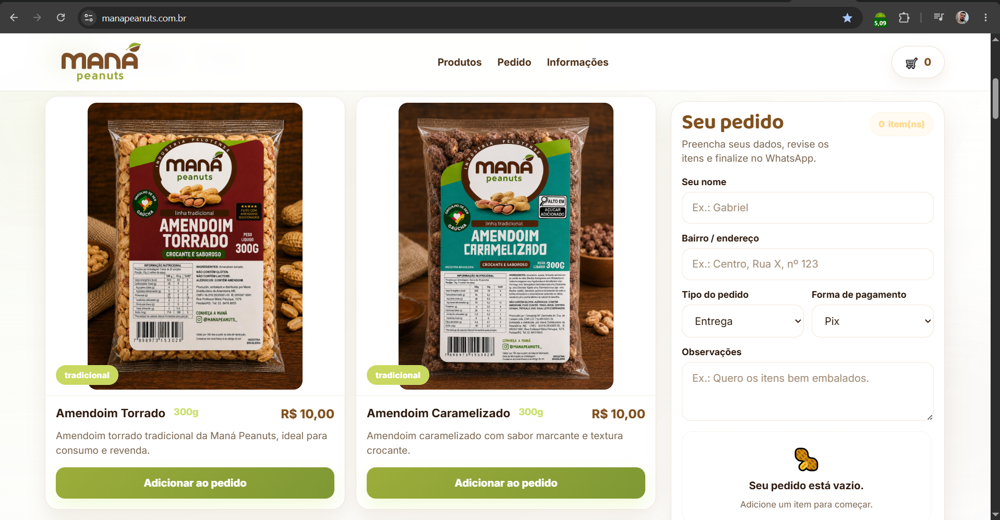
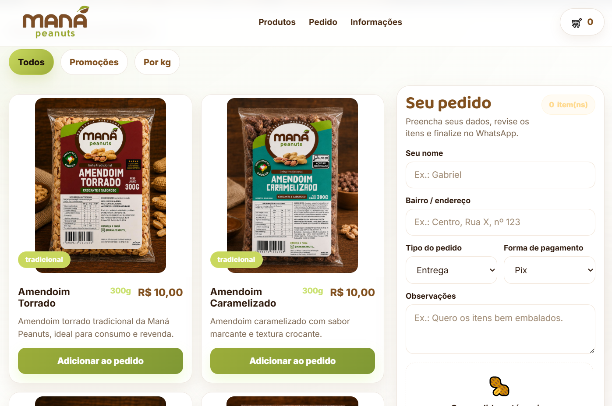
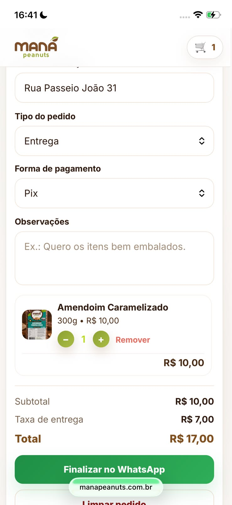
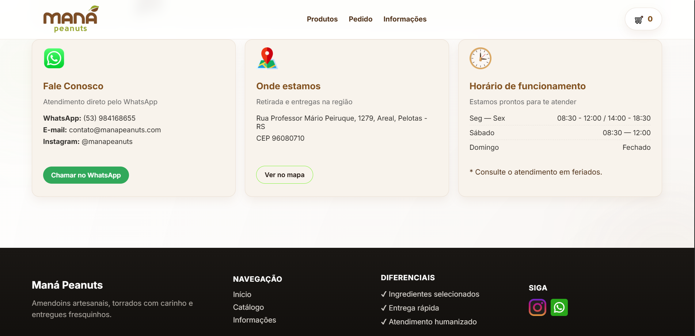

# Maná Peanuts Website

A real-world client project developed for Maná Peanuts, featuring a responsive product catalog, shopping cart, and WhatsApp-based checkout experience.

## Live Demo

🔗 https://manapeanuts.com.br

## Preview

### Home Page



### Product Catalog



### Mobile Version

<p align="center">
  
</p>

### Footer




## Features

* Responsive design for mobile, tablet, and desktop
* Dynamic product catalog
* Product category filtering
* Shopping cart management
* Quantity adjustment and item removal
* Real-time order summary
* Delivery and pickup options
* Multiple payment methods
* WhatsApp checkout integration
* Customer information form
* Form validation
* Local Storage persistence
* Automatic cart recovery
* Smooth animations and transitions
* Promotional video hero section

## Technologies Used

* HTML5
* CSS3
* JavaScript (Vanilla JS)
* Local Storage API
* WhatsApp API

## Highlights

* Fully responsive experience across mobile, tablet, and desktop devices.
* Persistent cart and customer data using Local Storage.
* Automated order generation through WhatsApp integration.
* Dynamic product filtering and cart management.
* Production deployment with custom domain configuration.

## Project Structure

```bash
.
├── assets/
│   ├── img/
│   ├── icons/
│   └── video/
├── css/
│   └── style.css
├── js/
│   └── script.js
├── index.html
└── README.md
```

## Author

Gabriel Pereira Schwanke

Frontend Developer
